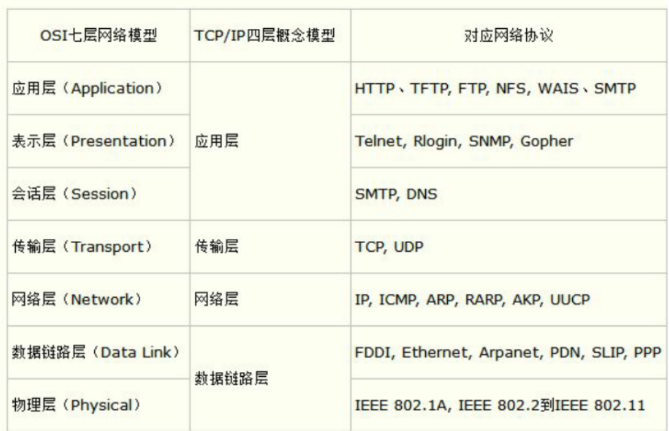

好的，以下是**字节跳动基础技术面试题**原题及其**标准回答 + 常见追问 + 追问答案**，可以直接在面试中复述使用。

---

### **1. 请简述 HTTP 协议的工作原理**

**回答**：
HTTP 是基于请求-响应模型的无状态协议。客户端向服务器发送请求，服务器返回资源（如 HTML、JSON）。默认使用 TCP 作为底层传输协议，常见方法有 GET、POST、PUT、DELETE。

**追问 1：HTTP 和 HTTPS 的区别？**
HTTPS 是基于 SSL/TLS 的加密版本，提供数据的加密、身份验证和完整性保护。HTTPS 使用 443 端口，而 HTTP 用 80。

**追问 2：HTTP/1.1 与 HTTP/2 有哪些改进？**

* HTTP/2 支持多路复用（同一连接多个请求并发）
* 头部压缩（减少冗余）
* 服务端推送（Server Push）
  相比 HTTP/1.1，性能更优。

---

### **2. 请解释什么是 TCP/IP 协议？**

**回答**：
TCP/IP 是互联网的基础协议栈，分为四层：

* 应用层（HTTP、FTP）
* 传输层（TCP、UDP）
* 网络层（IP）
* 链路层（Ethernet）

OSI 七层模型
应用层，表示层，会话层，传输层，网络层，数据链路层，物理层


**追问 1：TCP 三次握手过程？**

1. 客户端发送 SYN
2. 服务器回应 SYN+ACK
3. 客户端发送 ACK
   建立连接，防止伪连接。

**追问 2：TCP 和 UDP 的区别？**
TCP：面向连接、可靠、有序传输（如网页）。
UDP：无连接、不保证顺序、效率高（如直播、DNS）。

**追问 3: TCP 四次挥手过程？**
1. 客户端发送 FIN，进入FIN_WAIT_1
2. 服务器回应 FIN + ACK, 进入CLOSE_WAIT
<!-- 服务器在这中间需要保证数据完全传输，然后才会继续 -->
3. 服务器发送 FIN, 进入LAST_ACK
4. 客户端发送 FIN，
<!-- 服务器收到 FIN 之后，进入CLOSE (from CLOSE_WAIT) -->

**追问 4: TCP通过什么保证传输可靠？**
通过序列号和确认应答机制保证传输可靠。
序列号：信息在传递时，每个字节都有一个编号，接收端根据序列号进行排序。
确认应答：接收端收到数据后，会发送一个确认应答，表示“我已收到编号为 N 的数据”。
超时重传：发送端会定时检查是否有数据包未收到确认，如果检查发现有未收到的情况，会重传。
滑动窗口协议：发送端和接收端都有一个窗口，窗口大小表示接收端可以接收的数据量。发送端发送数据后，会等待接收端的确认应答，确认应答到达后，窗口会滑动，发送端可以继续发送数据。
拥塞控制：当网络拥塞时（丢包数量上升），减少数据发送速率，避免数据丢失。

**追问 5: TCP的流量控制是什么？怎么是实现的？有几种方式实现？**
流量控制是指接收端根据自身接收能力控制发送端发送数据的速率，避免接收端处理不过来。
实现：接收端会在 ACK 中放入自己的窗口大小，发送端根据窗口大小控制发送数据量。
有滑动窗口协议和拥塞控制两种方式实现。
滑动窗口协议：
发送端维护一个接收窗口，窗口大小根据接收端能力动态调整，接收端收到数据后，会发送 ACK 确认，确认中包含已接收数据的最大序列号，发送端根据这个序列号来移动窗口。
拥塞控制：当网络拥塞时（丢包数量上升），减少数据发送速率，避免数据丢失。
实现：
发送端维护拥塞窗口（cwnd）和慢启动阈值（ssthresh），初始值为 1，每次收到 ACK 拥塞窗口增加 1，当 cwnd >= ssthresh 时，进入拥塞避免阶段（线性增加），否则进入慢启动阶段（指数增加）。
接收端维护接收窗口（rwnd），根据拥塞窗口和接收能力动态调整。

Q: 什么是TCP流量控制的零窗口探测？
答： 当接收方通告窗口为 0，发送方不能继续发送数据。但为了不一直阻塞，它会定时发送零窗口探测包（ZWP），测试窗口是否恢复。

**追问 6：TCP的拥塞控制是什么？有几种实现？
TCP 拥塞控制用于防止网络中的中间节点（如路由器、交换机）过载导致性能下降，通过动态调整发送速率避免网络拥塞。
1. 慢启动（Slow Start）
初始设置拥塞窗口（cwnd）= 1 MSS
每收到一个 ACK，就把 cwnd 增加 1（指数增长）
每个 RTT 让 cwnd 翻倍，直到达到一个阈值 ssthresh

2. 拥塞避免（Congestion Avoidance）
当 cwnd ≥ ssthresh 时，进入线性增长阶段（每 RTT 增加 1 MSS）

3. 快速重传（Fast Retransmit）
收到 3 个重复 ACK（说明一个包丢了），不等超时就重传丢失段

4. 快速恢复（Fast Recovery）
重传后，把 ssthresh = cwnd / 2，cwnd 也减半，然后继续拥塞避免，同时也避免退回慢启动


## TCP超时重传(RTO, Retransmission Timeout)
RTO = SRTT + max(G, 4 * RTTVAR)
SRTT(Slow Start RTT): 最近的 RTT 样本（第一次 RTT）
RTTVAR: 最近 RTT 样本的差值（RTT 波动）
G: 一个常量，默认值为 1ms


| 流量控制              | 拥塞控制            |
| ----------------- | --------------- |
| 控制**端到端**两点间的接收能力 | 控制**网络中**整体负载压力 |
| 防止接收方被压垮          | 避免网络节点拥塞、丢包     |
| 滑动窗口实现            | 慢启动、拥塞避免等算法实现   |

---

### **3. 请说明什么是 DNS，它的作用是什么？**

**回答**：
DNS（域名系统）将域名解析为 IP 地址，使人类便于访问网站。它是网络访问的第一步。

**追问 1：DNS 查询过程？**
浏览器会优先查缓存 → 本地 DNS → 根服务器 → 顶级域名服务器 → 权威 DNS → 返回 IP。

**追问 2：DNS 劫持是什么？**
劫持是指中间人将请求重定向到错误 IP（如广告或钓鱼），可通过 DNS over HTTPS (DoH) 等手段防护。

**追问 3：DNS 劫持有什么方法可以避免？**
DNSSEC，是一种新技术，通过对数据进行数字“签名”来抵御此类攻击，从而使您确信数据有效。

---

### **4. 什么是负载均衡？请列举几种常见负载均衡算法。**

**回答**：
负载均衡将请求合理分发到多台服务器，提高系统吞吐量与可用性。

**常见算法**：

* **轮询（Round Robin）** 依次将请求分发给服务器，如 A→B→C→A…，适合性能均衡的服务器集群。（kafka默认也是轮询）
* **最少连接（Least Connections）** 把请求分给当前连接数最少的服务器，适用于长连接的业务（如 WebSocket）。
* **源地址哈希（IP Hash）** 根据客户端 IP 做哈希映射到指定服务器，适用于会话保持（如电商登录态）。
* **一致性哈希（Consistent Hashing）** 把请求和服务器都映射到哈希环上，适用于缓存等节点频繁增删的场景（如分布式缓存）。

**追问 1：Nginx 如何实现负载均衡？**
Nginx 使用 upstream 模块支持多种算法（如轮询、权重、IP hash）并具备健康检查机制。

**追问 2：一致性哈希原理？**
将服务器和请求都映射到 hash 环上，减少因节点变化导致的缓存命中率下降。

**追问 3：kafka 如何实现负载均衡？**
kafka可以分为三个部分，消费者，生产者和Broker
```
Kafka 客户端（生产者/消费者）
   ↓
Kafka Topic（主题）
   ↓
Kafka Partitions（分区）
   ↓
Kafka Brokers（节点）
```
**消费者**
消费者负载均衡是通过分区-消费者绑定关系自动协调的。通过 Consumer Group（消费组） 实现对分区的“协同消费”。
一个消费组内的消费者会自动进行 Rebalance，将所有分区平均分配到活跃消费者上：
- 有 N 个分区，M 个消费者（M ≤ N）：每个消费者会获得 N/M 个分区；
- 如果某个消费者下线，Kafka 会触发 rebalance，重新分配分区；
- 消费者之间不会重复消费，同一个分区只被一个消费者消费。

**生产者**
生产者端以 partition 为单位进行负载均衡。
发送到topic的partitions时，如果没有使用key，会使用轮询分配，如果使用了key，会通过key HASH的方式分配到固定分区，保证一致性

**Broker**
Kafka Controller 保证分区和 Leader 在多个 Broker 上均衡分布
Kafka 中的每个 Topic 分区由多个 Broker 节点 共同管理：
- 每个分区有一个 Leader，由某个 Broker 负责读写；
- 其余是 Follower，负责同步数据；
- Kafka Controller 自动将 Partition 均匀分布到 Broker 上，进行 Leader 选举，实现集群负载均衡。

例：
- 假设 Topic 有 6 个 Partition，Kafka 有 3 个 Broker；

- Kafka 会尽量将每个 Broker 分配到 2 个 Partition 的 Leader；

- 避免某个 Broker 负载过重或全部分区 Leader 都集中在一个 Broker 上。
---

### **5. 什么是缓存？缓存的作用是什么？**

**回答**：
缓存是把热点数据存储在更快的媒介中（如内存），以减少数据访问延迟和数据库压力。

**追问 1：缓存一致性怎么保证？**
常用策略包括：

* Cache Aside（失效后再查 DB）
* Write Through（写入 DB 时同时更新缓存）
* Write Back（先写缓存，异步写 DB）

**追问 2：常见的缓存淘汰策略？**

* LRU（最近最少使用）
* LFU（最少使用次数）
* FIFO（先进先出）

---

### **6. 什么是数据库事务？简述四个特性（ACID）**

**回答**：
事务是一组操作的集合，要么全部执行成功，要么全部失败。

**ACID 四特性**：

* 原子性：不可分割
* 一致性：执行前后数据合法
* 隔离性：事务间不互相干扰
* 持久性：一旦提交永久保存

**追问 1：隔离级别有哪些？**

* Read Uncommitted：可读未提交
* Read Committed：只能读已提交
* Repeatable Read：可重读
* Serializable：串行执行，最高隔离

**追问 2：如何实现分布式事务？**
常见方案：

* 2PC（两阶段提交）
* 3PC（三阶段提交）
* TCC（Try-Confirm-Cancel）
* 本地消息表 + 异步补偿机制

---

### **7. 请解释 SQL 语句，举例说明**

**回答**：
SQL 是操作关系型数据库的语言，支持查询、插入、更新、删除等操作。

**示例**：

```sql
SELECT name FROM user WHERE age > 30;
```

**追问 1：SQL 的 JOIN 有哪几种？**

* INNER JOIN：匹配双方都存在的
* LEFT JOIN：保留左表全部，右表无则 NULL
* RIGHT JOIN：相反
* FULL OUTER JOIN：左右都保留

**追问 2：SQL 和 NoSQL 查询有什么差异？**
SQL 基于结构化表，有标准语法；NoSQL 查询方式依赖具体实现（如 Mongo 的 JSON 查询语法）。

---

### **8. 什么是索引？作用是什么？**

**回答**：
索引是加快数据库查询的数据结构，常用 B+ 树。它能显著提升 WHERE、ORDER BY 等语句性能。
针对一个或多个字段构建高效查找结构（如排序结构或哈希结构）以加速数据查找。

**追问 1：聚簇索引和非聚簇索引的区别？**

* 聚簇索引：数据和索引存在一起（如 MySQL 的 InnoDB）
* 非聚簇索引：索引与数据分开，需回表查询

**追问 2：索引为什么适合高选择性字段？**
高选择性表示唯一值多，索引更能过滤数据。低选择性（如性别）命中率低，反而拖慢查询。

---

### **9. 什么是 NoSQL 数据库？常见类型？**

**回答**：
NoSQL 是非关系型数据库，适合大数据和高并发场景。

**类型**：

* 键值型：Redis
* 文档型：MongoDB
* 列存储：HBase、Cassandra、ClickHouse
* 图数据库：Neo4j

**追问 1：NoSQL 和关系型数据库如何选？**
结构复杂需强事务选关系型（如银行系统）；高并发、非结构化数据选 NoSQL（如日志系统）。

**追问 2：MongoDB 中如何建模？**
使用嵌套文档或数组代替 JOIN，适合频繁一起读取的数据。

---

### **10. 什么是分布式系统？简述特点**

**回答**：
分布式系统由多个节点构成，对用户透明，具备高可用、可扩展、容错等特性。

**特点**：

* 可扩展（水平扩展）
* 容错性（节点挂掉系统仍能工作）
* 一致性 vs 可用性（CAP 定理）
* 数据冗余与复制

**追问 1：CAP 原理？**
CAP：一致性（C）、可用性（A）、分区容忍性（P），三者最多只能同时满足两个。

**追问 2：常见一致性协议？**

* Paxos：复杂，效率低
* Raft：更易实现，核心为 Leader 选举 + 日志复制

---


### **11. 如何设计一个秒杀系统？**

**回答**：
秒杀系统需要考虑并发、库存扣减、订单生成等问题。

**设计要点**：

* 秒杀页面静态化：减少服务器负载。
* 按钮置灰：防止提前疯狂请求服务器，导致服务器未到设定时间就崩溃了
* 秒杀时间提前：用户提前进入秒杀页面，减少无效请求。
* 服务单一职责：微服务设计思想，每个服务只负责一个业务模块，如秒杀服务、订单服务、登录服务等。
  * 秒杀服务：处理秒杀逻辑，单独设计秒杀数据库，包括秒杀商品表、秒杀订单表等，避免超卖问题。
  * 订单服务：处理订单相关逻辑，如订单查询、订单支付等。
  * 登录服务：处理登录相关逻辑，如注册、登录验证等。
* 秒杀链接加盐：防止截取请求URL，提前秒杀，秒杀链接需要包含随机盐值。比方说，通过MD5加密随机字符串去做URL，例如：
  * 原始链接：`http://seckill.com/12345`
  * 加盐后：`http://seckill.com/12345?token=md5(12345+盐值)`
  * 需要服务端校验：
    * 服务端生成 URL 时，加盐并计算 MD5 值。
    * 用户请求时，服务端验证 MD5 值是否正确。
* 分布式锁：使用redis分布式锁解决超卖的问题
    * SET EX PX NX + 校验唯一随机值，再删除释放锁（要判断是否是当前线程加的锁）
    * 加锁：用户请求秒杀时，先尝试获取锁。
    * 解锁：秒杀完成或超时，释放锁。（用户请求三秒后超时，自动返回失败，重新点击秒杀按钮，再次请求）
* MQ异步处理：
  * 秒杀成功后，订单服务生成订单，MQ异步发送消息到订单队列。
  * 库存服务监听订单队列，扣减库存。
* 限流&降级&熔断：
  * 限流：限制请求，防止过大请求压跨服务器
  * 降级：秒杀服务出问题了，降级处理，不要影响其他服务
  * 熔断：服务有问题就熔断，熔断降级是一起出现的
* 异步处理：订单生成异步处理，减少响应时间。


### **11.1 如何设计秒杀系统的缓存？**

**回答**：

* 缓存预热：系统启动时，将秒杀商品信息加载到缓存中。
* 缓存击穿：高并发请求秒杀同一商品，缓存失效，导致大量请求直接打到数据库。解决方案：
  * 加锁：只有一个请求去数据库查询，其他请求阻塞。
  * 设置永不过期：缓存不过期，后台更新缓存。
* 缓存穿透：高并发请求不存在的商品，缓存不命中，导致大量请求打到数据库。解决方案：
  * 缓存空值：数据库查不到也缓存一个空值，下次同样请求直接返回空值。
  * 布隆过滤器：提前把可能存在的 key 放到布隆过滤器中，不存在的直接返回。
* 数据库读写分离：主库写、从库读。
* 异步处理：订单生成异步处理，减少响应时间。

### **11.2 秒杀系统如何防止超卖？**

**回答**：

* 数据库层面：秒杀商品表增加库存字段，扣减库存时更新库存字段。
* 缓存层面：预扣减库存，扣减成功再下单。
* 分布式锁：秒杀请求加锁，防止超卖。

### **11.3 秒杀系统如何保证数据一致性？**

**回答**：

* 最终一致性：秒杀完成后，订单服务异步更新订单状态，库存服务异步扣减库存。


### 12. HTTPS的连接过程和TCP的连接过程？
HTTPS 的连接过程是在 **TCP 三次握手（Three-way Handshake）** 的基础上，再加上一套 **TLS/SSL 握手（TLS/SSL Handshake）**，用来实现加密通信。下面我们将从 **相似点** 和 **不同点** 两方面进行对比说明：

---
### 🔁 相似点（Similarities between TCP Handshake and HTTPS Handshake）

| 点                 | 描述                    |
| ----------------- | --------------------- |
| 都有握手过程（Handshake） | 都需要在通信前建立连接，双方确认通信能力。 |
| 都有客户端发起           | 通常由客户端（浏览器）发起请求连接。    |
| 都在连接建立后传输数据       | 握手成功后才能进行真正的数据传输。     |

---

### ❌ 不同点（Differences between TCP Handshake and HTTPS Handshake）

| 对比点       | TCP（三次握手）            | HTTPS（含 TLS 握手）                   |
| --------- | -------------------- | --------------------------------- |
| 层级（Layer） | 传输层（Transport Layer） | 应用层（Application Layer）之上的加密层      |
| 目的        | 建立可靠的连接              | 建立安全的加密通信通道                       |
| 步骤数量      | 3 次                  | 多达 6\~9 步，涉及证书、公钥、对称密钥协商等         |
| 加密支持      | 不提供加密，只负责可靠传输        | 提供数据加密、身份验证、防篡改                   |
| 时间开销      | 较小                   | TLS 握手增加了延迟（优化方案如 TLS 1.3 减少握手轮次） |

---

### ✅ HTTPS 连接全过程（结合 TCP 与 TLS）

1. **TCP 三次握手（3-way Handshake）**
   建立基础的可靠连接（HTTP 也是用这个）。

2. **TLS 握手过程**（以 TLS 1.2 为例）

   * ClientHello（包含支持的加密算法等）
   * ServerHello（选择加密算法，返回证书）
   * 客户端验证证书，生成预主密钥（pre-master key）
   * 使用服务器公钥加密预主密钥并发送
   * 双方生成对称加密密钥
   * 握手完成后发送 Finished 消息，进入加密通信阶段

3. **开始加密通信**（HTTP 内容通过 TLS 加密后发送）

---

### 💡 面试追加问题（附答案）

#### Q1: 为什么 HTTPS 传输中使用的是对称加密传输，而不是一直使用非对称加密？

**答：** 非对称加密速度慢，计算成本高；而对称加密速度快，适合大量数据传输。TLS 握手阶段用非对称加密协商密钥，之后用对称加密传输数据。

| 类型   | 对称加密（Symmetric） | 非对称加密（Asymmetric） |
| ---- | --------------- | ----------------- |
| 密钥   | 加密与解密使用同一密钥     | 加密与解密使用公钥/私钥      |
| 速度   | 🚀 非常快（纳秒级）     | 🐢 较慢（毫秒级甚至更慢）    |
| 安全性  | 需要安全传输密钥        | 不需要共享私钥，适合密钥交换    |
| 适用场景 | 数据传输、大量加解密      | 身份认证、密钥交换、签名验证    |

---

#### Q2: TLS 1.3 如何优化握手性能？

**答：**

* 减少握手轮次，只需 1-RTT（单往返时间）即可完成握手；
* 支持 0-RTT（恢复连接时直接发送数据）；
* 去掉了不安全的加密算法（如 RSA 握手、SHA1）。

---

#### Q3: 如果证书过期或不受信任，HTTPS 会怎样？

**答：** 客户端浏览器会拒绝连接，提示“不安全连接”或“证书错误”。

---

#### Q4: 什么是TLS？

**答：** TLS（Transport Layer Security）是一种安全协议，用于在客户端和服务器之间建立加密连接。它提供身份验证、数据加密和完整性保护，确保数据在传输过程中不被篡改或窃听。

#### Q5: 什么是TLS 1.3？

**答：** TLS 1.3 是 TLS 协议的最新版本，引入了多项新功能和改进，如：

* 更快的握手速度（1-RTT 或 0-RTT）
* 更安全的加密算法（如 AES-GCM、ChaCha20-Poly1305）
* 更严格的身份验证（证书验证、OCSP  stapling）
* 更简洁的握手消息（Header Compression）


# **数据结构与算法部分**


### 1. 请解释什么是数组、链表、栈、队列、堆，并说明它们的特点。

| 数据结构 | 英文名         | 特点                                |
| ---- | ----------- | --------------------------------- |
| 数组   | Array       | 连续内存，支持随机访问 O(1)，插入删除代价高 O(n)     |
| 链表   | Linked List | 非连续内存，每个节点指向下一个，插入删除 O(1)，查找 O(n) |
| 栈    | Stack       | 后进先出 LIFO，只允许在一端操作，操作时间复杂度 O(1)   |
| 队列   | Queue       | 先进先出 FIFO，插入从队尾，删除从队首，操作复杂度 O(1)  |
| 堆    | Heap        | 特殊的树结构，最大堆（任意节点不小于子节点），最小堆（任意节点不大于子节点），常用于优先队列，操作复杂度 O(logn) |

---

### 2. 简述三分查找算法，并说明其时间复杂度。

**三分查找（Ternary Search）**是将有序数组分为三段来查找目标值的方法，通常用于**函数极值查找**。

**时间复杂度：** O(log₃n)

**示例代码（Python）：**

```python
def ternary_search(f, left, right, eps=1e-6):
    while right - left > eps:
        m1 = left + (right - left) / 3
        m2 = right - (right - left) / 3
        if f(m1) < f(m2):  # 极小值
            right = m2
        else:
            left = m1
    return (left + right) / 2
```

---

### 3. 请解释什么是递归，并举例说明。

**递归（Recursion）**：函数直接或间接调用自身，通常需要设置**终止条件（base case）**。

**示例：斐波那契数列（Fibonacci）**

```python
def fib(n):
    if n <= 1:
        return n
    return fib(n-1) + fib(n-2)
```

---

### 4. 简述动态规划算法，并举例说明。

**动态规划（Dynamic Programming）**：通过记录子问题结果（记忆化）来避免重复计算，适用于**最优子结构 + 重叠子问题**。

**示例：背包问题**

```python
def knapsack(weights, values, W):
    n = len(weights)
    dp = [[0]*(W+1) for _ in range(n+1)]
    for i in range(1, n+1):
        for w in range(W+1):
            if weights[i-1] <= w:
                dp[i][w] = max(dp[i-1][w], dp[i-1][w-weights[i-1]] + values[i-1])
            else:
                dp[i][w] = dp[i-1][w]
    return dp[n][W]
```

---

### 5. 请解释什么是贪心算法，并举例说明。

**贪心算法（Greedy Algorithm）**：每一步都选择当前最优解，适用于**贪心选择性质 + 最优子结构**问题。

**示例：区间调度**

```python
def interval_scheduling(intervals):
    intervals.sort(key=lambda x: x[1])  # 按结束时间升序
    end = count = 0
    for s, e in intervals:
        if s >= end:
            count += 1
            end = e
    return count
```

---

### 6. 简述图算法，包括深度优先搜索（DFS）和广度优先搜索（BFS）。

| 算法  | 英文名                  | 原理简述        | 应用场景           |
| --- | -------------------- | ----------- | -------------- |
| DFS | Depth-First Search   | 类似递归，尽可能往深走 | 拓扑排序、连通性判断     |
| BFS | Breadth-First Search | 使用队列，层级遍历   | 最短路径（无权图）、层序遍历 |

**示例：BFS 找最短路径**

```python
from collections import deque
def bfs(graph, start):
    visited = set()
    queue = deque([start])
    while queue:
        node = queue.popleft()
        visited.add(node)
        for neighbor in graph[node]:
            if neighbor not in visited:
                queue.append(neighbor)
    return visited
```

---

### 7. 请解释什么是哈希表，并说明其作用。

**哈希表（Hash Table）**：通过哈希函数将键映射到数组索引，实现快速插入、查找、删除操作（平均时间复杂度 O(1)）。

**作用：**

* 快速查找（如字典）
* 去重（如集合）
* 统计频率（如 Counter）

---

### 8. 简述排序算法，包括冒泡排序、选择排序、插入排序等。

| 排序算法 | 英文名            | 最坏复杂度 | 稳定性 | 说明             |
| ---- | -------------- | ----- | --- | -------------- |
| 冒泡排序 | Bubble Sort    | O(n²) | 稳定  | 每轮将最大值“冒”到末尾   |
| 选择排序 | Selection Sort | O(n²) | 不稳定 | 每轮选最小值放在前面     |
| 插入排序 | Insertion Sort | O(n²) | 稳定  | 插入到已排序序列中的合适位置 |
| 归并排序 | Merge Sort     | O(nlogn) | 稳定 | 分治，先局部有序再整体有序 |
| 快速排序 | Quick Sort     | O(nlogn) | 不稳定 | 分治，选基准值大的放右边，小的放左边 |
| 堆排序   | Heap Sort      | O(nlogn) | 不稳定 | 利用最大堆性质，选择最大值 |

---

## 系统设计

### 1. 简述 RESTful API 的设计原则

**RESTful API（Representational State Transfer）** 是一种面向资源的 Web API 设计风格。

**设计原则包括：**

* 使用 HTTP 方法表示操作（GET、POST、PUT、DELETE）
* URL 表示资源，如 `/users/1`
* 无状态（Stateless）：每次请求必须携带所有上下文
* 响应使用 JSON 或 XML 表示资源
* 统一接口（Uniform Interface）

**示例：**

```http
GET /users/1 → 获取用户1信息  
POST /users → 创建用户  
```

---

### 2. 解释 SSR（服务器端渲染）与 CSR（客户端渲染）

| 渲染方式 | 全称                    | 优点          | 缺点     | 适用场景       |
| ---- | --------------------- | ----------- | ------ | ---------- |
| SSR  | Server-Side Rendering | 首屏加载快，有利SEO | 服务端压力大 | 传统网站、内容展示类 |
| CSR  | Client-Side Rendering | 前后端分离，交互灵活  | 首屏加载慢  | SPA（单页应用）  |

---

### 3. 简述微服务架构，它有什么特点？

**微服务架构（Microservices Architecture）**：将系统拆分为多个可独立部署的小服务，每个服务负责单一业务功能。

**特点：**

* 单一职责，服务独立部署、扩展
* 服务间通过 API 通信（通常是 REST/gRPC）
* 技术栈可异构
* 易于 DevOps、CI/CD
* 容错性更好，但复杂度更高（服务治理、链路追踪）

---

### 4. 什么是分布式数据库，常见设计模式？

**分布式数据库（Distributed Database）**：数据分布在多台机器上，用户感知为一个整体。

**常见设计模式：**

* **水平分片（Sharding）**：根据 key 拆分（如 user\_id）
* **主从复制（Master-Slave Replication）**：提高读性能
* **一致性哈希（Consistent Hashing）**：应对节点变化
* **CAP 权衡**：可用性 vs 一致性 vs 分区容错性

**常见系统：** MySQL + ShardingSphere，TiDB，CockroachDB，MongoDB 分片集群

---

### 5. 简述分布式缓存的设计原则

**分布式缓存设计原则：**

* **热点数据预热**（避免缓存穿透）
* **一致性哈希算法**（数据分布均匀）
* **双写一致性处理**（数据库和缓存同步）
* **过期策略**（LRU/LFU/TTL）
* **雪崩/击穿/穿透防御**

  * 缓存穿透：布隆过滤器防止无效 key 查询
  * 缓存击穿：加锁防止同时回源
  * 缓存雪崩：使用过期时间随机化+限流

**常见中间件：Redis、Memcached**

---

### 6. 分布式锁及常见实现方式

**分布式锁（Distributed Lock）**：用于协调分布式系统中的互斥资源访问。

**实现方式：**

* **基于 Redis**：SETNX + EXPIRE 或使用 Redisson、Lua 脚本保证原子性
* **基于 ZooKeeper**：临时顺序节点 + watcher，天然支持锁竞争
* **数据库悲观锁/乐观锁**：如`SELECT FOR UPDATE`、版本号字段

**要解决的问题：**

* 原子性
* 过期/续约
* 主从一致性（如 Redis 主从复制延迟）

---

### 7. 分布式事务的处理方式

**常见分布式事务处理方案：**

1. **两阶段提交（2PC）**：经典但阻塞、易出错
2. **三阶段提交（3PC）**：引入超时，但实现复杂
3. **本地消息表 + 异步确认**：高可用推荐方案（RocketMQ 事务消息）
4. **TCC 模型（Try-Confirm-Cancel）**：每个服务预留三个接口，适合强一致性业务

* 追问：讲解一下三阶段提交和用rabbitmq的实现方式
答：三阶段提交是指：
  * 第一阶段：协调者向所有参与者发送准备请求，参与者执行本地事务并返回准备好状态
  * 第二阶段：协调者根据所有参与者的响应，如果都是准备好状态，则协调者向所有参与者发送提交请求，参与者执行本地事务并返回提交成功状态
  * 第三阶段：协调者根据所有参与者的响应，如果有一个参与者返回失败状态，则协调者向所有参与者发送回滚请求，参与者执行本地事务并返回回滚成功状态
* 用rabbitmq实现方式：
  * 第一阶段：协调者发送准备请求，参与者执行本地事务并返回准备好状态，参与者将本地事务执行结果发送到一个队列中
*
---

### 8. 什么是负载均衡，以及常见算法

**负载均衡（Load Balancing）**：将请求分发至多个服务节点，提升系统吞吐与稳定性。

**常见负载均衡算法：**

* **轮询（Round Robin）**
* **加权轮询（Weighted Round Robin）**
* **最少连接数（Least Connections）**
* **一致性哈希（Consistent Hashing）**

**实现方式：**

* **客户端负载均衡**：如 Ribbon、gRPC 内置
* **服务端负载均衡**：如 Nginx、LVS
* **注册中心+反向代理**：如 Nacos + Gateway

---


## 设计模式

---

### 5. 什么是单例模式（Singleton Pattern）？请实现一个单例类。

**定义：** 确保某个类在程序运行期间**只存在一个实例**，并提供一个全局访问点。

**适用场景：** 配置类、连接池、日志管理器等。

**Python 实现：**

```python
class Singleton:
    _instance = None

    def __new__(cls):
        if not cls._instance:
            cls._instance = super().__new__(cls)
        return cls._instance

a = Singleton()
b = Singleton()
assert a is b  # True
```

---

### 6. 什么是工厂模式（Factory Pattern）？请实现一个工厂类。

**定义：** 提供一个创建对象的接口，**由子类决定实例化哪一个类**，解耦创建逻辑。

**适用场景：** 对象种类较多时（如：图形、按钮、数据库驱动等）
w
**Python 实现：**

```python
class Dog:
    def speak(self):
        return "Woof"

class Cat:
    def speak(self):
        return "Meow"

class AnimalFactory:
    def create(self, animal_type):
        if animal_type == "dog":
            return Dog()
        elif animal_type == "cat":
            return Cat()

f = AnimalFactory()
animal = f.create("dog")
print(animal.speak())  # Woof
```

---

### 7. 什么是观察者模式（Observer Pattern）？请实现一个观察者模式。

**定义：** 一个对象状态发生变化时，自动通知所有依赖它的对象（即观察者）。

**适用场景：** 发布-订阅系统、事件系统。

**Python 实现：**

```python
class Subject:
    def __init__(self):
        self._observers = []

    def attach(self, obs):
        self._observers.append(obs)

    def notify(self, msg):
        for obs in self._observers:
            obs.update(msg)

class Observer:
    def update(self, msg):
        print(f"Got message: {msg}")

s = Subject()
o1, o2 = Observer(), Observer()
s.attach(o1)
s.attach(o2)
s.notify("Event happened")
```

---

### 8. 什么是策略模式（Strategy Pattern）？请实现一个策略模式。

**定义：** 定义一系列算法，把它们一个个封装起来，使它们可以互换，**用于运行时切换算法策略**。

**适用场景：** 排序策略、压缩策略、折扣策略等。

**Python 实现：**

```python
class Strategy:
    def execute(self, data):
        pass

class AddStrategy(Strategy):
    def execute(self, data):
        return sum(data)

class MultiplyStrategy(Strategy):
    def execute(self, data):
        result = 1
        for d in data:
            result *= d
        return result

class Context:
    def __init__(self, strategy):
        self.strategy = strategy

    def run(self, data):
        return self.strategy.execute(data)

ctx = Context(AddStrategy())
print(ctx.run([1, 2, 3]))  # 6
ctx.strategy = MultiplyStrategy()
print(ctx.run([1, 2, 3]))  # 6
```

---

### 9. 什么是装饰者模式（Decorator Pattern）？请实现一个装饰者模式。

**定义：** 动态地为对象添加新功能，不改变其原有结构。

**适用场景：** 动态增强类的功能（如 Flask 中的路由修饰器）

**Python 实现：**

```python
def logger(func):
    def wrapper(*args, **kwargs):
        print(f"Calling {func.__name__}")
        return func(*args, **kwargs)
    return wrapper

@logger
def greet(name):
    print(f"Hello {name}")

greet("ByteDance")
```

---

### 10. 什么是代理模式（Proxy Pattern）？请实现一个代理模式。

**定义：** 提供一个代理类代替真实对象访问，可以添加控制、缓存、权限等逻辑。

**适用场景：** 缓存代理、安全代理、远程代理（RPC）

**Python 实现：**

```python
class RealSubject:
    def request(self):
        print("RealSubject: handling request.")

class Proxy:
    def __init__(self):
        self.real = RealSubject()

    def request(self):
        print("Proxy: do something before")
        self.real.request()
        print("Proxy: do something after")

p = Proxy()
p.request()
```


### 11.操作系统中的进程调度？
虽然看起来是并行执行，但实际上是并发执行的，操作系统通过时间片轮转调度算法来实现并发执行。
常见的有三种方式
* 时间片轮转调度
* 优先级调度
* 多级反馈队列调度
* 最短作业优先调度：可能会造成饥饿问题，即长作业一直得不到执行
* 响应时间优先调度：可能会造成饥饿问题，即高响应时间的作业一直得不到执行


### 12.操作系统中，进程之间的通信方式？
共享内存，消息传递，管道，信号量，套接字等。
* 共享内存：多个进程可以访问同一块物理内存，进程可以直接读写共享内存中的数据，不需要进行数据的复制，速度快，但需要同步机制来避免竞争条件。
* 消息传递（消息队列）：进程之间通过发送消息来进行通信，每个进程都有自己的消息队列，消息的发送和接收需要系统调用，效率低，但可以实现进程之间的解耦。
* 管道：管道是一种半双工的通信方式，数据只能单向流动，有匿名管道和命名管道两种。
* 信号量：信号量是一个计数器，用于多进程对共享数据的访问，进程可以通过信号量来阻塞或唤醒另一个进程。
* 套接字：套接字是一种通信机制，允许不同主机之间的进程进行通信。

| 模式  | 英文术语        | 特点          | 类比场景               |
| --- | ----------- | ----------- | ------------------ |
| 单工  | Simplex     | 只能单向通信      | 电台广播               |
| 半双工 | Half Duplex | 可双向通信，但不能同时 | 对讲机（walkie-talkie） |
| 全双工 | Full Duplex | 可同时双向通信     | 电话通话               |


### 13.打开一个网站，背后会有哪些事情？
DNS解析 → TCP握手 → TLS握手 → 发送HTTP请求 → 接收响应 → 渲染页面
**DNS解析**，会尝试在浏览器中找是否有DNS缓存（或者被拦截），如果命中缓存，直接返回IP地址，如果没有命中缓存，会向DNS服务器发起请求，DNS服务器会返回IP地址。
**TCP握手**，建立连接，三次握手，四次挥手。
**TLS握手**，协商加密算法，生成对称密钥，交换公钥。
**发送HTTP请求**，浏览器向服务器发送请求，服务器接收请求，处理请求，返回响应。
**接收响应**，浏览器接收响应，解析响应，渲染页面。
**浏览器解析HTML**，构建DOM树，解析CSS，构建CSSOM树，合并DOM树和CSSOM树，布局，绘制。

### 追问 Q1. 在网站建立连接之后，我们关闭再重新打开，浏览器和服务器之间还需要重新建立连接吗？后台会发生什么？有哪些机制参与其中？
**情况 1**：你只是关闭了当前 tab / 切换 tab
浏览器可能会保留 TCP/TLS 连接（短时间内未超时）
**情况 2**：彻底关闭浏览器或电脑休眠
所有 TCP 连接会被关闭，再次访问需要重新建立连接

机制参与：
**DNS缓存**：前文提到，浏览器会缓存DNS访问记录，下次访问的时候会直接访问对应IP
**TLS会话缓存**：如果服务器支持TLS会话回复，客户端可以携带上一次握手时的session ID，避免重新交换密钥，减少TLS握手时间
    | 机制                       | 简介                                   | TLS 版本         |
    | ------------------------ | ------------------------------------ | -------------- |
    | **Session ID**（会话标识）     | 服务端保存 `session_id → 对称密钥` 映射，客户端下次携带 | TLS 1.0 \~ 1.2 |
    | **Session Ticket**（会话票据） | 服务端将会话加密后打包发给客户端，恢复时直接使用             | TLS 1.2+       |

**HTTP缓存**：如果资源未过期（图片，CSS，JS等），使用本地缓存
**Cookie/Session/Token**：如果资源过期（过期时间在Cookie中），浏览器会缓存Cookie和Session，下次访问的时候会直接发送给服务器
    登录信息往往会保存在cookie/localStorage中，再次打开页面可以自动识别身份


### 14. new 和 malloc 的共同点？区别是什么？
* 共同点：都是从堆中分配内存
* 区别：
    * new 是 C++ 中的运算符，会调用构造函数，malloc 是 C 中的函数，不会调用构造函数
    * new 可以分配基本数据类型和对象，malloc 只能分配内存
    * new 分配内存后会返回对象的指针，malloc 分配内存后会返回内存的指针
    * new 可以调用对象的析构函数，而 malloc 不能
    * new和delete配套使用，malloc和free配套使用，后者容易发生内存泄露
### 追问Q1. C++有哪些防止内存泄露的方法？
* 智能指针：C++11 引入了智能指针，如 shared_ptr、unique_ptr、weak_ptr 等，它们可以自动管理内存的释放，避免手动管理内存时容易发生的错误。
* 手动管理内存：在一些特殊场景下，如多线程编程、需要手动管理内存的场景等，需要手动管理内存。
### 追问Q2. c++中智能指针有几种？
* shared_ptr：共享指针，多个指针可以指向同一个对象，对象的引用计数会增加，当最后一个指针销毁时，对象会被释放。
* unique_ptr：独占指针，只能有一个指针指向同一个对象，当指针销毁时，对象会被释放。
* weak_ptr：弱指针，指向 shared_ptr 管理的对象，不会增加对象的引用计数，用于解决 shared_ptr 循环引用的问题。
* auto_ptr：C++98 引入的智能指针，已经被废弃，不推荐使用。
* scoped_ptr：C++11 引入的智能指针，与 unique_ptr 类似，但是不能拷贝构造和赋值运算符重载，只能移动构造和移动赋值运算符重载。


### 15. 多线程/进程开发？锁的设计思路？
| 对比点  | 多线程（Thread）     | 多进程（Process）         |
| ---- | --------------- | -------------------- |
| 内存空间 | 共享（堆/静态区）       | 独立                   |
| 创建成本 | 低               | 较高                   |
| 通信方式 | 共享变量 + 锁        | IPC（管道、Socket、Queue） |
| 稳定性  | 任一线程崩溃会影响主进程    | 单个进程崩溃不会影响其他         |
| 应用场景 | 轻量任务、IO密集、协作型任务 | 隔离任务、CPU密集、容错需求高     |

**锁的设计核心原则**
粒度控制：锁粒度越小并发越高，但逻辑复杂
尽量缩短锁的持有时间，避免在锁内进行 IO 或长计算
避免死锁：加锁顺序统一 + 尽量少用嵌套锁
使用无锁结构（CAS / 原子变量） 进行优化（例如：Java 的 AtomicInteger）

| 锁类型                     | 说明           | 场景           |
| ----------------------- | ------------ | ------------ |
| 互斥锁（Mutex）              | 最常用，互斥访问共享资源 | 多线程共享内存      |
| 读写锁（RWLock）             | 允许多个读同时，写互斥  | 缓存、配置数据读多写少  |
| 分布式锁（如 Redis、ZooKeeper） | 跨机器协调        | 分布式任务调度、秒杀控制 |
| 自旋锁（SpinLock）           | 空等（CPU忙等待）   | 锁时间极短的场景     |
| 递归锁（ReentrantLock）      | 同一线程可重复获取    | 递归函数、回调场景    |

### Q1: Python 多线程为什么不能充分利用多核？
答： 因为 Python 的 CPython 实现有 全局解释器锁（GIL），多线程仍只能单核执行，适用于 IO 密集任务而非 CPU 密集。

### Q2: 如何设计线程安全的计数器？
答：

用原子变量（Java 中的 AtomicInteger）

Python 中用 threading.Lock

Redis 中用 INCR 指令实现分布式原子计数

### Q3: 分布式场景下如何设计锁？
答：

Redis 的 SET NX 搭配过期时间

加锁时写入唯一标识（如 UUID）保证锁可辨识

解锁前校验标识，避免误删他人锁（Lua 脚本）

或使用 Redlock（多节点 + quorum）


### 16.操作系统中的进程的内存空间是独立的，是怎么实现的？
进程控制表（PID）
操作系统为每个进程分配独立的虚拟地址空间（Virtual Address Space），通过**内存管理单元（MMU, Memory Management Unit）和页表（Page Table）**将虚拟地址映射到实际物理地址，借此实现不同进程互不干扰的内存空间隔离。

进程创建时，会分配一个独立的虚拟地址空间
```
0x00000000 ~ 0xFFFFFFFF（32位系统）
```

## 内存隔离的核心机制：MMU + 页表
MMU：内存管理单元，负责虚拟地址到物理地址的转换
页表：存放在物理内存中的，每个进程都有自己的页表，页表中存放着虚拟地址到物理地址的映射关系
```
虚拟页号 => 物理页框号
```

## 多级页表：
为了解决页表过大的问题，现在会采用多级页表的结构
    4KB 页：虚拟地址 32 位，可支持 4GB 内存（2^32 个页）
    4MB 页：虚拟地址 20 位，可支持 1GB 内存（2^20 个页）
    1GB 页：虚拟地址 12 位，可支持 256MB 内存（2^12 个页）

## 如何实现地址隔离?
每次上下文切换的时候，操作系统会：
切换当前页表基地址(CR3寄存器)
重新加载TLB（Translation Lookaside Buffer）
TLB：页表缓存，用于加速虚拟地址到物理地址的转换，TLB 缓存了最近使用的页表项，避免每次地址翻译都要访问内存。

## 追问Q2: 为什么线程的地址空间是共享的？
因为线程属于同一个进程，它们使用同一页表。线程只是不同的执行流，共享：
虚拟内存
全局变量
文件描述符


### 17.实际物理地址是如何进行分配的？
所有的物理内存都被划分成一个一个固定大小的页框，通常为4kb，用编号进行定位
操作系统有一个物理位框位图，可以用来统计有哪些页框是空闲的

当进程发出内存分配申请时，例如malloc(8192)
内核会为进程的虚拟地址分配两个新的页（4kb/页），但还没有分配物理内存
当进程访问虚拟地址时，会由于页不存在导致触发页中断（Page Fault），此时操作系统会：
查找有哪些空闲页框
将其中一个页框分配给进程
将页表项更新为新的物理页框地址
返回进程继续执行（通知MMU，刷新TLB）
每次访问新的虚拟也都会出发一个缺页中断，从而分配一个新的物理页框

假设：
虚拟页号 0x0002（虚拟地址 0x2000）
被映射到物理页框 Frame #45（物理地址 0x2D000）
即：
```markdown
虚拟地址 0x00002000
       = 页号 2 + 偏移 0
页表：虚拟页 2 ➜ 物理页框 45
物理地址 = 45 * 4KB = 0x2D000
```

🔒 保证隔离：每个进程只能访问自己的物理页框
分配时，操作系统确保页框归属唯一进程；

页表控制访问权限（读/写/执行）；

内核态才允许修改页表。

## Q1: 物理内存分配为什么不连续？
A: 避免外部碎片，支持虚拟内存分页调度，简化内存管理。

## Q2: 是不是每次 malloc 都分配物理内存？
A: 不是。
malloc只会分配虚拟内存，只有访问时才触发缺页中断，才实际分配物理页框（称为按需分页 on-demand paging）。


## Q3: 页表是否也需要分配物理内存？
A: 是的，页表本身是存放在物理内存中的结构，也需要物理页框，属于“系统内存”。

## Q4: 页表项的组成？
A: 页表项中主要记录物理页框的地址信息，以及一些访问控制位，如是否可读、是否可写、是否可执行等。

## Q5. 如果用户申请多个小于一页的对象，如何避免浪费？
用户空间使用 内存池（memory pool）/ slab 分配器。
操作系统内核也使用 Slab/SLUB 分配器来高效管理小对象。


### 18.高可用的实现方式？
数据库层面、后端层面、前端层面

## ✅ 一、数据库层面的高可用（High Availability in Database）

### 1. 主从复制（Master-Slave Replication）

* 主库负责写入，从库负责只读操作。
* 一旦主库宕机，可快速切换到从库继续服务（提升容错性）。
* 常见于 MySQL、PostgreSQL、MongoDB 等。

### 2. 自动故障转移（Failover）

* 配合 **Keepalived**、**MHA**、**Orchestrator** 等工具实现主库故障自动切换。
* 多用于分布式部署的数据库集群。

### 3. 分片 + 分区（Sharding & Partitioning）

* 防止单节点成为瓶颈，提高横向扩展能力。
* 对大数据量系统尤为重要（如用户行为日志库、交易流水库）。

### 4. Redis Sentinel / Cluster 模式

* Redis 单点故障问题严重，因此通常采用：

  * **哨兵（Sentinel）模式**：自动检测主从状态并切换；
  * **集群模式（Cluster）**：分布式存储 + 自动分片 + 高可用。

### 5. 数据备份与恢复机制

* 定时冷备份 + Binlog 日志 + 云端存储。
* 避免逻辑误删/硬件故障后无法恢复数据。

---

## ✅ 二、后端层面的高可用（High Availability in Backend）

### 1. 服务注册与负载均衡

* 使用 Nginx、HAProxy 或 Kubernetes Ingress 控制器。
* 将请求均衡分发到多个服务实例。

### 2. 微服务架构

* 单点拆分为多个独立服务，如认证、用户、内容等。
* 各模块互不影响，便于快速恢复和单独扩容。

### 3. 异步任务 + 消息队列（如 Celery、Kafka）

* 任务异步处理，避免阻塞主服务线程。
* 即使处理失败也可通过重试机制保证任务最终执行。

### 4. 健康检查与自动拉起

* Kubernetes Pod 健康检查失败会触发自动重启；
* Docker 容器支持 restart policy（如 `always`, `on-failure`）。

### 5. 灰度发布与服务熔断

* 利用 Feature Flag 或金丝雀发布机制平滑上线新版本；
* 降级策略保证部分服务出错不影响主流程。

---

## ✅ 三、前端层面的高可用（High Availability in Frontend）

### 1. 静态资源多源部署（CDN）

* 前端资源部署至 CDN（如 Cloudflare、阿里云 CDN、Azure CDN）节点。
* 用户就近访问、降低延迟，即使主站挂了也能加载基础页面。

### 2. Service Worker + PWA（渐进式应用）

* 可缓存页面、接口数据，实现离线访问。
* 提升移动端和弱网环境下的用户体验。

### 3. 前端监控与降级策略

* 使用 Sentry、LogRocket、Datadog 等监控错误；
* 一旦核心组件报错，切换为静态模板或本地默认数据展示。

### 4. 热更新 / 回滚机制

* 支持基于版本的构建和上线管理（Vite, Webpack + CI/CD）。
* 出现问题可立即回滚到上一个稳定版本。

---

## 🧩 总结表格

| 层面   | 关键措施                      | 示例                         |
| ---- | ------------------------- | -------------------------- |
| 数据库层 | 主从复制 / 自动切换 / 备份          | Redis Sentinel / MySQL MHA |
| 后端层  | 微服务 / 自动重启 / 降级           | Flask + Celery + Docker    |
| 前端层  | CDN / Service Worker / 监控 | React + Azure CDN + Sentry |

---

如果你需要用于面试的**回答模板/PPT素材/英文版本**，我可以继续为你生成，是否需要？
/ 监控 | React + Azure CDN + Sentry |

Redis，哨兵，集群部署
数据库，缓存保护，防击穿，雪崩
大流量，限流，降级


### 19. 七层网络模型？
* 应用层：提供服务接口，HTTP、FTP、SMTP、DNS 等
* 表示层：数据编码，加密
* 会话层：会话管理
* 传输层：TCP、UDP 等
* 网络层：IP 协议
* 链路层：以太网、无线局域网等
* 物理层：传输介质（如电缆、无线信号）
* 数据链路层：负责在物理层传输的比特流中添加帧头帧尾，实现差错检测和纠正


### 20. 讲解一下HTTP1-HTTP3
HTTP1.0: 无状态，无连接，简单快速
HTTP1.1: 持久连接，管道化，增加缓存处理，带宽优化，Host 头处理
HTTP2: 二进制分帧，多路复用，头部压缩，服务端推送
HTTP3: 基于 UDP 的 QUIC 协议，提供了类似 TCP 的拥塞控制和丢包恢复机制


- HTTP1: 每次请求都重建TCP连接（网页，css,js,图片等都需要发一个新的TCP），无并发请求，无缓存机制，无Host头
- HTTP1.1: 默认启动长连接(Keep-Alive)
```h
GET /index.html HTTP/1.1
Host: example.com
Connection: keep-alive
```
当下一步通过长连接继续请求时，会复用TCP连接，减少了建立和关闭连接的开销。
```h
GET /style.css HTTP/1.1
Host: www.example.com
Connection: keep-alive
```
存在的问题：HTTP1.1的访问虽然公用TCP，并且使用了管道化，连续发送，但是如果出现队头阻塞的情况时（a,b,c三个请求，a需要5秒，但后面b,c只需要1秒，被a阻塞）

- http2:
在HTTP2中，采取了Stream ID的形式传递数据
其中客户端发起的都是奇数，服务端返回的都是偶数

| 协议         | 所在层级     | 说明                    |
| ---------- | -------- | --------------------- |
| **HTTP/2** | 应用层（第7层） | 用于浏览器、API、前后端通信       |
| **TLS**    | 表示层（第6层） | 可选（但实际 HTTPS 场景中基本开启） |
| **TCP**    | 传输层（第4层） | HTTP/2 必须基于 TCP 连接    |
| **HTTP/2 帧** | 数据层（第5层） | 二进制分帧，每个帧代表一个完整的 HTTP 消息 |

| 协议         | 所在层级                    | 说明                                |
| ---------- | ----------------------- | --------------------------------- |
| **HTTP/3** | 应用层（第7层）                | 本质仍然是 HTTP 请求/响应模型                |
| **QUIC**   | 同时涵盖 表示层 + 传输层（6 + 4 层） | 取代了传统的 TCP + TLS；基于 UDP 实现可靠传输和加密 |
| **UDP**    | 传输层（第4层）                | QUIC 基于 UDP 构建                    |
| **IP**     | 网络层（第3层）                | 不变，还是 IP 通信                       |


| 概念   | Web1.0 / 2.0 / 3.0  | HTTP1.0 / 1.1 / 2 / 3  |
| ---- | ------------------- | ---------------------- |
| 所属领域 | 网络内容形态（前端/互联网形态）    | 网络传输协议（后端/底层协议）        |
| 代表什么 | 用户和互联网的交互模式         | 客户端和服务器之间的通信方式         |
| 举例   | 静态页面 → 社交互动 → 区块链应用 | 多连接 → 长连接 → 多路复用 → UDP |
| 关键词  | 内容、互动、去中心化、链上       | TCP、QUIC、二进制帧、TLS      |


### 21.volatile关键字
在线程中对关键词的修改会被立刻写到主内存中
内存可以分成主内存和工作内存
线程在运行时，会将主内存中的变量复制一份到工作内存中，线程对变量的修改都是在工作内存中的，不会影响主内存中的变量。