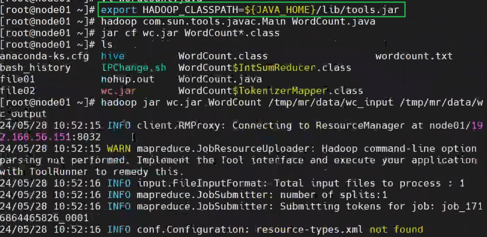
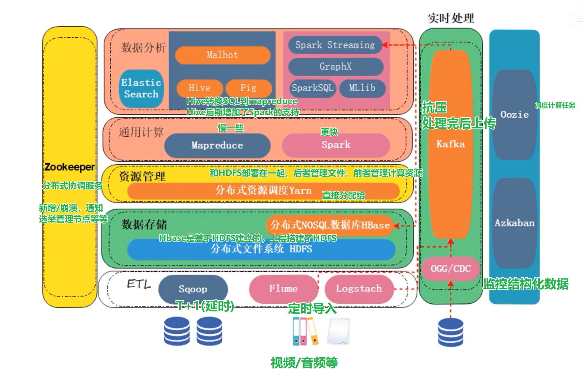

# HADOOP 学习笔记
本文档需要结合Hadoop权威指南第四版进行阅读

## P28 （MAPReduce编写后运行）
- 需要从环境中引用额外的包

```bash
export HAD0OP_CLASSPATH=${JAVA_HOME}/lib/tools.jar
hadoop com.sun.tools.javac.Main WordCount.java # 编译java文件
jar cf wc.jar Wordcount*.class # jar cf:创建一个jar包
hadoop jar wc.jar WordCount /tmp/mr/data/wc-input /tmp/mr/data/wc-output # 运行程序
```



ZooKeeper
Spark Streaming: spark的流处理（实时）
GraphX: 图处理
SparkSQL：将SQL转换成Spark
MLlib：机器学习库


ES包括以下所有内容，因此单独是一个组件