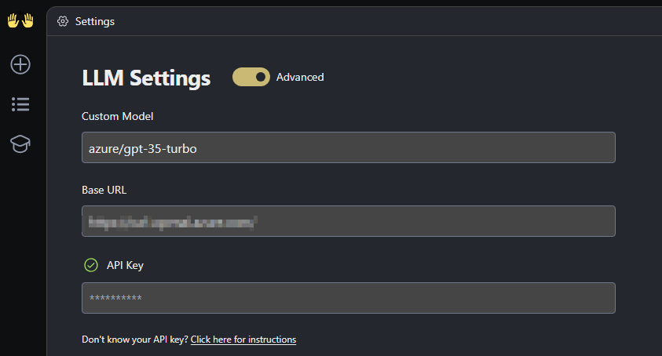
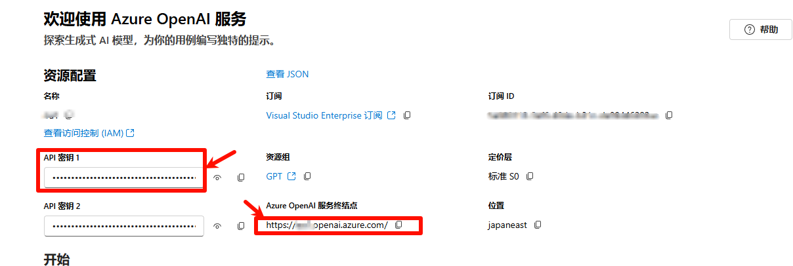

# 如何在本地部署openhands

 因为官网关于openhands的部署缺乏一些关键信息，所以写了一些内容来帮助大家更好的部署


1. Install WSL Command
```bash
wsl --install
```

2. 本地部署命令

```bash
docker pull docker.all-hands.dev/all-hands-ai/runtime:0.27-nikolaik

docker run -it --rm --pull=always  -e LLM_NATIVE_TOOL_CALLING=true   -e SANDBOX_RUNTIME_CONTAINER_IMAGE=docker.all-hands.dev/all-hands-ai/runtime:0.27-nikolaik    -e LOG_ALL_EVENTS=true    -v /var/run/docker.sock:/var/run/docker.sock    -v ~/.openhands-state:/.openhands-state    -p 3000:3000    --add-host host.docker.internal:host-gateway    --name openhands-app    docker.all-hands.dev/all-hands-ai/openhands:0.27
```


3. 在后台添加你对应的LLM的apikey和对应的endpoint






### FAQ
## 1. 如果收到错误
```json
BadRequestError: litellm.BadRequestError: AzureException BadRequestError - Error code: 400 - {'error': {'message': "Invalid value for 'tool_choice': 'tool_choice' is only allowed when 'tools' are specified.", 'type': 'invalid_request_error', 'param': 'tool_choice', 'code': None}}
```
请添加
```bash
-e LLM_NATIVE_TOOL_CALLING=true
```


